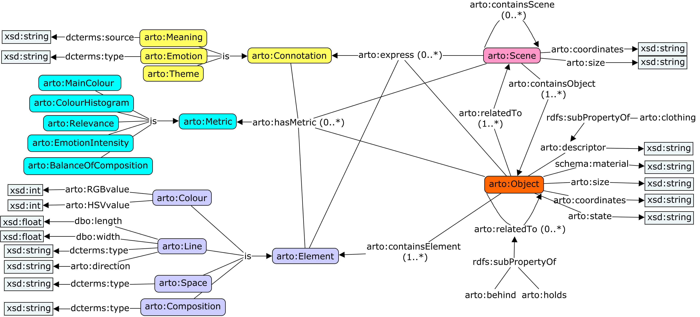

# Artwork Object Ontology (ARTO)

The Artwork Object Ontology (ARTO) is a comprehensive ontology designed for describing and contextualizing artworks. It consists of two main components: the Artwork Descriptive Model and the Artwork Contextual Model. ARTO aims to provide a structured and detailed representation of artworks, facilitating tasks such as artwork captioning and information retrieval.

## Features

- Artwork Descriptive Model: Represents the artistic expression of artworks, including visual elements, scenes, and emotions.
- Artwork Contextual Model: Captures background information such as artwork metadata, historical framework, and related events.
- Data-driven approach: The ontology is built based on existing available data and incorporates concepts from established cultural heritage ontologies like CIDOC-CRM and EDM.
- Evaluation: The ontology has been validated using the OntOlogy Pitfall Scanner (OOPS!) and refined through interviews with art experts.
- Integration with Large Language Models (LLMs): ARTO can be integrated with LLMs to enable automated artwork captioning.

## Models

###Artwork Descriptive Model

The Artwork Descriptive Model is designed to encapsulate the representation of the content of artworks. It focuses on detailed content representation including visual elements, scenes, and emotional undertones that are conveyed through the artwork. This model aims to provide a framework that allows users to visually reconstruct the artwork in their mind’s eye, fostering a deep, intuitive understanding.

###Artwork Contextual Model

The Artwork Contextual Model complements the descriptive aspects by incorporating contextual information about the artwork. This model includes metadata, historical context, and related events, enriching the viewer’s appreciation and understanding of the artwork beyond its physical appearance.

## Example 

To demonstrate the application of the ARTO models, consider the artwork “The Shepherdess” by William-Adolphe Bouguereau. The Descriptive Model would detail the visual elements like the serene posture of the shepherdess and the gentle, pastoral setting. The Contextual Model would provide insights into the painting’s creation in 1889, during the artist's life, reflecting the social and historical aspects of that era in France.

## Contributing

We welcome contributions to enhance and expand the Artwork Object Ontology. If you'd like to contribute, please follow these steps:

1. Fork the repository.

2. Create a new branch for your feature or bug fix.

3. Make your changes and commit them with descriptive messages.

4. Push your changes to your forked repository.

5. Submit a pull request detailing your changes and their benefits.

## License

This project is licensed under the [MIT License](LICENSE).

## Contact

For any questions, suggestions, or collaborations, feel free to reach out to Can Yang(can.yang@anu.edu.au)

We appreciate your interest and feedback!