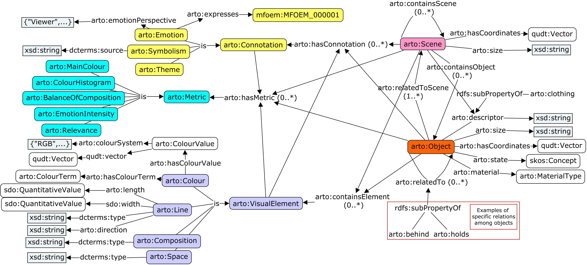
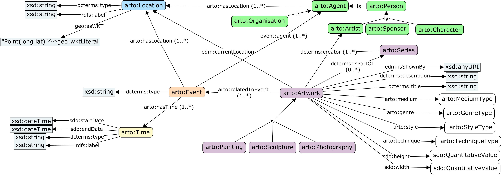
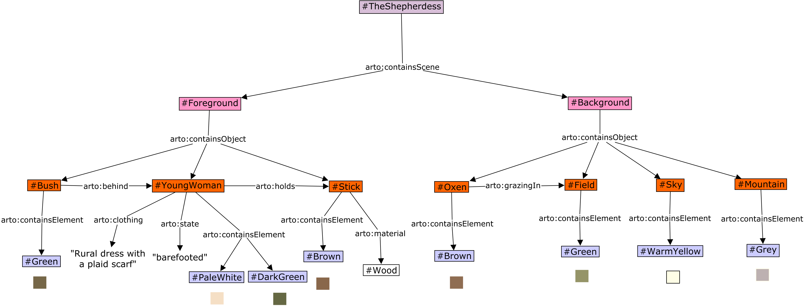

# Artwork Object Ontology (ARTO)

The Artwork Object Ontology (ARTO) is a comprehensive ontology designed for describing and contextualizing artworks. It consists of two main components: the Artwork Descriptive Model and the Artwork Contextual Model. ARTO aims to provide a structured and detailed representation of artworks, facilitating tasks such as artwork captioning and information retrieval.


## Features

- Artwork Descriptive Model: Represents the artistic expression of artworks, including visual elements, scenes, and emotions.
- Artwork Contextual Model: Captures background information such as artwork metadata, historical framework, and related events.
- Data-driven approach: The ontology is built based on existing available data and incorporates concepts from established cultural heritage ontologies like CIDOC-CRM and EDM.
- Evaluation: The ontology has been validated using the OntOlogy Pitfall Scanner (OOPS!) and refined through interviews with art experts.
- Integration with Large Language Models (LLMs): Knowledge graphs based on ARTO can be integrated with LLMs by providing context to prompt engineering tasks, enabling automated artwork captioning.


## Models

### Artwork Descriptive Model

The Artwork Descriptive Model is designed to encapsulate the representation of the content of artworks. It focuses on detailed content representation including visual elements, scenes, and emotional undertones that are conveyed through the artwork. This model aims to provide a framework that allows users to visually reconstruct the artwork in their mind’s eye, fostering a deep, intuitive understanding.




### Artwork Contextual Model

The Artwork Contextual Model complements the descriptive aspects by incorporating contextual information about the artwork. This model includes metadata, historical context, and related events, enriching the viewer’s appreciation and understanding of the artwork beyond its physical appearance.




## Example 

To demonstrate the application of the ARTO models, consider the artwork “[The Shepherdess](https://www.wikiart.org/en/william-adolphe-bouguereau/shepherdess-1889)” by William-Adolphe Bouguereau. The Descriptive Model would detail the visual elements like the serene posture of the shepherdess and the gentle, pastoral setting. The Contextual Model would provide insights into the painting’s creation in 1889, during the artist's life, reflecting the social and historical aspects of that era in France. This example is presented below using RDF-star and RDF to help better understand the differences between representing events in the contextual model. 

### Contextual Model of The Shepherdess using RDF-star


### Contextual Model of The Shepherdess using RDF


### Descriptive Model of The Shepherdess



## Interview: ARTO Conceptual Evaluation

Art experts verbally described some example artworks, labelling their own captions according to descriptive, contextual, and interpretive categories. The experts listed and ranked the aspects they considered most crucial when describing artworks, shared their approaches to describing art, and provided insights on depicting subjective elements like emotion and subject matter. They also outlined the most challenging elements to describe and their thoughts on verifying the accuracy of descriptions. Finally, after being introduced to the initial ontology design, the experts applied the new ontology to create captions for four artwork examples and assessed the comprehensiveness and structure of the generated content. You can access and check the detailed interview questionnaire and results in the folder [interview](/interview). 


## Related work

The table summarize the goal, strength and weakness of previous works.

| Name      | Domain           | Goal       | Ontology Scope                         | Strengths    | Weaknesses                   |
|-----------|------------------|---------------------------|---------------------|--------------------------------------|-----------------------------------------------------------------------|
| CIDOC-CRM                                               | Cultural Heritage | To provide a theoretical and practical tool for integrating information in the cultural heritage domain, facilitating complex data queries and explorations. |  Events, actors, artifacts, and their relationships in cultural heritage contexts |  Comprehensive model, high-level data integration and retrieval |    It's lack of the descriptive information of artworks         |
| Visual Representation (VIR)                             | Visual Arts       | To extend CIDOC-CRM to describe the representation and relationships of visual features.                         | Visual elements, media, representation, and relationships        | Enhances visual data accessibility and retrieval                   | Lacks detailed description of visual elements like color and composition                       |
| Functional Requirements for Bibliographic Records (FRBR)| Bibliography      | To provide a comprehensive model for bibliographic records, focusing on the relationships between different entities such as works, expressions, manifestations, and items. | Bibliographic records, works, expressions, manifestations, items, and their relationships  | Clear structure for bibliographic data management               | Only cover bibliographic resources                     |
| ArCo                                                    | Cultural Heritage | To describe and manage Italian cultural heritage, including artifacts, sites, and other cultural assets.                |  Italian cultural artifacts, heritage sites, and their relationships | Focused on Italian cultural heritage, detailed descriptions     | Specific to Italian context, may require adaptation for other contexts |
| Europeana Data Model (EDM)                              | Digital Libraries | To provide a flexible framework for integrating and managing cultural heritage data from various sources across Europe.  |  Digital objects, metadata, cultural heritage collections, and their relationships  | Supports multilingual data integration  | Mainly for data organization and retrieval |
| Visual Resources Association Core (VRA CORE)            | Visual Resources  | To manage and describe visual resources, including images and visual works, in a standardized way.      | Visual works, images, titles, artistic styles, materials, etc.       | Improves visual data interoperability                           | May require extension for other types of resources             |
| ICON                                                    | Art History       | To catalog and describe iconographic content, including symbols, motifs, and other iconographic elements.               | Icons, symbols, motifs, background information, artwork interpretation                  | Specialized in iconographic data.           Facilitates iconographic research                               | Limited to iconographic data.                          |
| Art & Architecture Thesaurus (AAT)                      | Art & Architecture| To provide a structured vocabulary for art and architecture, including terms and concepts used in these fields.          | Art and architectural terms, concepts, and relationships       | Widely adopted in art and architecture communities. Enhances data consistency and retrieval                         | Need connect to other concepts to facilitate artwork captioning |
| Union List of Artist Names (ULAN)                       | Art               | To provide a structured and standardized list of artist names and biographical information.                             | Artist names, biographical data, and their relationships           | Standardized artist identification.   Enhances artist data accuracy and linkage                       | Limited to artist names, not cover other entities           |
|  [Linked Art ](https://linked.art/)     | Art & Cultural Heritage | To link art data across different institutions and provide a comprehensive and interconnected view of art-related information. | Artworks, artists, events, and their relationships               | Facilitates cross-institutional data integration. Promotes data interoperability     | Mainly for data organization not the artwork captioning |


## Pipeline to Artwork Image Captioning
Integrating KG with artwork image captioning requires a systematic and clearly defined process. This pipeline elaborates on the steps involved, from initial analysis to the construction of the knowledge graph and the potential ways to collaborate with LLMs. The aim is to create a robust, scalable knowledge graph that aligns with the FAIR principles[^1] and apply it to the artwork image captioning task.


- **Data Workflow**
  - **Data Sources**:  
    The available data sources are mainly from online museums or galleries. Given our goal to construct an artwork knowledge graph aimed at facilitating subsequent tasks related to artworks, especially the captioning of artwork images, we filter based on the information contained in the data sources. The available data sources are listed in Table 1.

  - **Data Processing**:  
    Given the vast and varied size of collected data, the Data Processing step is essential. It deals with inconsistencies, duplicates, and errors in the data, and standardizes the data format for the knowledge graph. This process ensures that only high-quality, reliable data is used for building the knowledge graph.

  - **Data Analysis**:  
    It's essential to conduct exploratory analysis in the data processing phase to identify errors and outliers within the data. Once the data is processed and cleaned, we then proceed with a descriptive analysis. This helps us understand the distribution, trends, and other characteristics of various attributes in the data, providing crucial insights to inform our ontology design decisions.

- **Ontology Design**:  
  According to the results of the data analysis, we collaborate with domain experts to define the main entities (e.g., people, places, and events) and establish a structured model that captures the relationships and hierarchies of these entities.

- **Knowledge Graph**:  
  In the knowledge graph construction phase, we process the cleaned data to identify and extract meaningful entities and their relationships, guided by our designed ontology. Our dataset primarily consists of metadata, which can be directly mapped, and text data, which necessitates the use of NLP techniques for entity extraction. Given the diverse origins of our data, inconsistencies often emerge, such as overlaps, contradictions, or varied representations of similar facts. To address these challenges and enrich our KG, we integrate trusted external resources like Wikidata and DBpedia. With these additions, we need to align different sources, extend the information, and merge them to build a unified knowledge graph.

- **Knowledge Graphs work with LLMs**:  
  The combination of LLMs and KG provides a promising solution. LLMs could generate human-like text, while KGs offer structured knowledge about artworks. Together, they can generate captions that are coherent, contextual, and accurate.

[^1]: [FAIR principles](https://www.go-fair.org/fair-principles/)


## Data Mapping Using ARTO


### Data Analysis

- Identify the available data for the artworks you want to describe.
- Recognize the key entities in the data, such as artworks, artists, scenes, objects, and elements.
- Note down the relationships between entities, such as creation relationships, containment relationships, etc.

### Instance Creation
- Create instances of the mapped classes for each entity.
- Assign a unique URI to each instance.
- Record the correspondence between instances and the original data.

### Property Population
- Populate the instances using the properties provided by ARTO:
  - Object properties: Link instances to other related instances.
    - For example, `dc:creator` links an artwork to its artist.
  - Data properties: Assign appropriate values to instances.
    - For example, `dc:title` represents the title of an artwork, `arto:material` represents the material of an object.
- Record the properties used and their corresponding values.

```xml
<?xml version="1.0" encoding="UTF-8"?>
<rdf:RDF xmlns:rdf="http://www.w3.org/1999/02/22-rdf-syntax-ns#"
         xmlns:arto="http://w3id.org/arto#"
         xmlns:dc="http://purl.org/dc/terms/"
         xmlns:event="http://purl.org/NET/c4dm/event.owl#"
         xmlns:time="http://www.w3.org/2006/time#"
         xmlns:edm="http://www.europeana.eu/schemas/edm/">

  <!-- Artwork -->
  <arto:Artwork rdf:about="artwork_uri">
    <dc:title>Artwork Title</dc:title>
    <dc:creator rdf:resource="artist_uri"/>
    <arto:hasConnotation rdf:resource="connotation_uri"/>
    <arto:hasEvent rdf:resource="event_uri"/>
    <!-- Add more artwork properties -->
  </arto:Artwork>

  <!-- Artist -->
  <arto:Artist rdf:about="artist_uri">
    <rdf:type rdf:resource="http://xmlns.com/foaf/0.1/Person"/>
    <!-- Add artist properties -->
  </arto:Artist>

  <!-- Scene -->
  <arto:Scene rdf:about="scene_uri">
    <arto:containsObject rdf:resource="object_uri"/>
    <arto:express rdf:resource="emotion_uri"/>
    <!-- Add more scene properties -->
  </arto:Scene>

  <!-- Object -->
  <arto:Object rdf:about="object_uri">
    <arto:material>Object Material</arto:material>
    <arto:containsElement rdf:resource="element_uri"/>
    <!-- Add more object properties -->
  </arto:Object>

  <!-- Element -->
  <arto:Color rdf:about="element_uri">
    <arto:RGBValue>RGB Value</arto:RGBValue>
    <!-- Add more element properties -->
  </arto:Color>

  <!-- Connotation -->
  <arto:Meaning rdf:about="connotation_uri">
    <arto:source>Connotation Source</arto:source>
    <!-- Add more connotation properties -->
  </arto:Meaning>

  <!-- Emotion -->
  <arto:Emotion rdf:about="emotion_uri">
    <arto:emotionType>Emotion Type</arto:emotionType>
    <!-- Add more emotion properties -->
  </arto:Emotion>

  <!-- Event -->
  <arto:Event rdf:about="event_uri">
    <event:agent rdf:resource="agent_uri"/>
    <arto:hasTime rdf:resource="time_uri"/>
    <edm:happenedAt rdf:resource="location_uri"/>
    <arto:relatedToArtwork rdf:resource="artwork_uri"/>
    <!-- Add more event properties -->
  </arto:Event>

  <!-- Time -->
  <time:TemporalEntity rdf:about="time_uri">
    <arto:timeType>Time Type</arto:timeType>
    <!-- Add more time properties -->
  </time:TemporalEntity>

  <!-- Location -->
  <arto:Location rdf:about="location_uri">
    <dc:locationType>Location Type</dc:locationType>
    <!-- Add more location properties -->
  </arto:Location>

  <!-- Add more instances and properties as needed -->

</rdf:RDF>
```


## How to contribute?


To extend the Artwork Object Ontology (ARTO) for specific domains or use cases, follow these steps: First, identify the concepts, relationships, or properties that are not currently covered in ARTO. Next, design new classes to represent the missing concepts, ensuring consistency with ARTO's existing class hierarchy and naming conventions. Then, determine the new properties and relationships needed to capture additional information, specifying their data types, domains, ranges, and cardinality. Integrate the newly designed classes, properties, and relationships into ARTO's structure, update the documentation, and test the extended ontology with sample data to validate its effectiveness. Finally, maintain and update the extension over time to accommodate new requirements and feedback, ensuring compatibility with future versions of ARTO.


We welcome contributions to enhance and expand the *Artwork Object Ontology*. If you'd like to contribute, please follow these steps:

1. Fork the repository. 
2. Create a new branch for your feature or bug fix. 
3. Make your changes and commit them with descriptive messages. 
4. Push your changes to your forked repository. 
5. Submit a pull request detailing your changes and their benefits. 


## Apply LLMs in artwork captioning 


- Analyze the structure and content of ARTO to design prompt templates that align with the ontology, mapping specific classes and properties to corresponding placeholders or variables in the templates. Based on the concepts create a captioning template and the prompts for LLMs. 
- Define validation criteria based on ARTO ensure factual accuracy, consistency with the ontology, and alignment with artwork attributes, and develop automated validation rules for the generated captions.
  Extract entities and relationships from the generated captions using NLP techniques, compare them with the corresponding classes and properties in KG, and flag any inconsistencies, errors, or missing information.
- Utilize KG to fact-check generated captions, verify the accuracy of specific claims, dates, locations, and other details, and ensure consistency with the known attributes and relationships of the artworks and entities.
- Assess the semantic coherence and relevance of the generated captions with the artwork and KG, ensuring they capture main themes, concepts, or emotions, and provide meaningful, informative descriptions that align with the ontology and knowledge base.


An example is

```

[Artwork Title] is a [Artwork Type] created by [Artist Name] in [Creation Year].

The work depicts [Main Content/Subject], which includes [Key Visual Elements, Objects, Figures, or Scenes]. The artist employs [Composition Techniques, Color Schemes, or Artistic Styles] to [How These Formal Elements Interact with or Convey the Content].

[Artist Name]'s personal background [Brief Description of Artist's Background], which is reflected in the artwork through [Influence of Artist's Background on the Artwork]. The work was created in the context of [Historical and Cultural Context of Creation], during which [Relevant Historical or Cultural Events or Circumstances].

The themes of [Artwork Title] revolve around [Interpretation of Meaning, Symbolism, or Emotional Impact], but different viewers may interpret it differently based on their [Factors Influencing Viewer Interpretation].

The significance of this work in art history lies in its [Significance or Influence of the Artwork in Art History], as it [Impact or Contribution of the Artwork to Art or Culture].


prompt

Please generate a description of an artwork based on the following prompt, covering aspects such as content, formal elements, creation background, interpretation, and art historical significance, presented in a clear, coherent, and engaging manner:

Artwork Information:
- Title: [Artwork Title]
- Artist: [Artist Name]
- Year of Creation: [Creation Year]
- Type: [Artwork Type]

Content: [Brief Description of Main Content, Subject, or Key Visual Elements]
Visual Elements: [Brief Description of Composition, Color, Technique, or Style]
Artist Background: [Key Points About Artist's Background or Influences]
Historical Context: [Key Points About Historical, Cultural, or Personal Context of Creation]
Interpretation: [Potential Interpretations of Meaning, Symbolism, or Emotion]
Art Historical Significance: [Significance or Influence of the Artwork in Art History]

Please generate the description with approximately [Desired Word Count] words.
```


By leveraging ARTO/ONTO/KB for prompt creation and validation, the caption generation process becomes more structured, accurate, and aligned with the domain knowledge. The ontology and knowledge base serve as a foundation for generating relevant and informative prompts, while also providing a framework for validating the generated captions against established facts, relationships, and constraints. This approach ensures that the captions are not only linguistically fluent but also semantically consistent and factually accurate, enhancing the overall quality and reliability of the generated descriptions.


## License

This project is licensed under the [MIT License](LICENSE).


