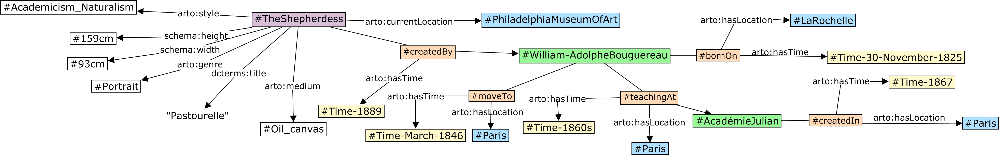

# Artwork Object Ontology (ARTO)

The Artwork Object Ontology (ARTO) ([ARTO TTL file](v0.1/arto.ttl)) is a comprehensive ontology designed for describing and contextualizing artworks. It consists of two main components: the Artwork Descriptive Model and the Artwork Contextual Model. ARTO aims to provide a structured and detailed representation of artworks, facilitating tasks such as artwork captioning and information retrieval.


## Features

- Artwork Descriptive Model: Represents the artistic expression of artworks, including visual elements, scenes, and emotions.
- Artwork Contextual Model: Captures background information such as artwork metadata, historical framework, and related events.
- Data-driven approach: The ontology is built based on existing available data and incorporates concepts from established cultural heritage ontologies like [CIDOC-CRM](http://www.cidoc-crm.org/cidoc-crm/) and [EDM](https://pro.europeana.eu/page/edm-documentation).
- Evaluation: The ontology has been validated using the [OntOlogy Pitfall Scanner (OOPS!)](https://github.com/oeg-upm/OOPS) and refined through interviews with art experts.
- Integration with Large Language Models (LLMs): Knowledge graphs based on ARTO can be integrated with LLMs by providing context to prompt engineering tasks, enabling automated artwork captioning.


## Models

### Artwork Descriptive Model

The Artwork Descriptive Model is designed to encapsulate the representation of the content of artworks. It focuses on detailed content representation including visual elements, scenes, and emotional undertones that are conveyed through the artwork. This model aims to provide a framework that allows users to visually reconstruct the artwork and capture multiple perspectives and emotions related to and triggered by the artwork, which may foster a better understanding and representation of them.


### Artwork Contextual Model

The Artwork Contextual Model complements the descriptive aspects by incorporating contextual information about the artwork. This model includes metadata, historical context, and related events, enriching the viewer’s appreciation and understanding of the artwork beyond its physical appearance.


## Example 

To demonstrate the application of the ARTO models, consider the artwork “[The Shepherdess](https://www.wikiart.org/en/william-adolphe-bouguereau/shepherdess-1889)” by William-Adolphe Bouguereau. The Descriptive Model would detail the visual elements like the serene posture of the shepherdess and the gentle, pastoral setting. The Contextual Model would provide insights into the painting’s creation in 1889, during the artist's life, reflecting the social and historical aspects of that era in France. This example is presented below using RDF-star and RDF to help better understand the differences between representing events in the contextual model (more examples of various artwork types available [here](examples/README.md)).

### The picture of the artwork "The Shepherdess"


### Contextual Model of The Shepherdess using RDF-star


``` turtle
# Artist information
<#William-AdolpheBouguereau> <#bornOn> <#Time-30-November-1825> .
<#William-AdolpheBouguereau> <arto:hasLocation> <#LaRochelle> .
<<#William-AdolpheBouguereau> <#bornOn> <#Time-30-November-1825>> <arto:hasTime> <#Time-30-November-1825> .

# Artist's professional history
<#William-AdolpheBouguereau> <#teachingAt> <#AcadémieJulian> .
<<#William-AdolpheBouguereau> <#teachingAt> <#AcadémieJulian>> <arto:hasTime> <#Time-1860> .
<<#William-AdolpheBouguereau> <#teachingAt> <#AcadémieJulian>> <arto:hasLocation> <#Paris> .

# Artist's activities
<#William-AdolpheBouguereau> <#moveTo> <#Paris> .
<<#William-AdolpheBouguereau> <#moveTo> <#Paris>> <arto:hasTime> <#Time-March-1846> .

# Creation place and time
<<#TheShepherdess> <#createdBy> <#William-AdolpheBouguereau>> <arto:hasTime> <#Time-1889> .
<<#TheShepherdess> <#createdBy> <#William-AdolpheBouguereau>> <#createdIn> <#Paris> .
<<<#TheShepherdess> <#createdBy> <#William-AdolpheBouguereau>> <#createdIn> <#Paris>> <arto:hasLocation> <#Paris> .
```

### Contextual Model of The Shepherdess using RDF


``` turtle
# Artwork connected to Creation event
<#TheShepherdess> <hasEvent> <#Creation> .

# Creation event information
<#Creation> <createdBy> <William-Adolphe Bouguereau> .
<#Creation> <arto:hasTime> <1889> .

# Artist information
<William-Adolphe Bouguereau> <hasEvent> <#Birth> .
<William-Adolphe Bouguereau> <hasEvent> <#Teaching> .
<William-Adolphe Bouguereau> <hasEvent> <#MoveHouse> .

# Birth event information
<#Birth> <arto:hasLocation> <#LaRochelle> .
<#Birth> <arto:hasTime> <30 November 1825> .

# Teaching event information
<#Teaching> <teachAt> <Académie Julian> .
<#Teaching> <arto:hasLocation> <#Paris> .
<#Teaching> <arto:hasTime> <1860> .

# Move event information
<#MoveHouse> <arto:hasLocation> <#Paris> .
<#MoveHouse> <arto:hasTime> <March 1846> .

# Academic institution events
<Académie Julian> <hasEvent> <#Creation> .
<#Creation> <arto:hasLocation> <#Paris> .
<#Creation> <arto:hasTime> <1867> .
```

### Descriptive Model of The Shepherdess


## Versioning (Based on experts feedback (e.g., art experts, semantic web experts, conference reviewers))


### ARTO's unique contribution compared to existing ontologies

*Version 0.1.1 | Date: 2024-06-05*


ARTO's main contributions include integrating both descriptive content and contextual information into a unified framework, providing an ontological structure specifically for artwork caption generation. The existing ontologies focus on museum management and artifact cataloging, while artwork captioning requires capturing detailed visual content and the relation to the context. ARTO‘s target users are artwork captioning developers and AI researchers who have distinctly different requirements compared to existing ontology users. Our users demand fine-grained artwork representations that are machine-understandable, enabling seamless integration into AI models for automated caption generation. They require representations that enable visual-semantic alignment and support the development of comprehensive, context-aware captions. These captions go beyond simply stating artworks' provenance, metadata, etc., instead encompassing detailed content representations and connecting them with cultural context and artistic interpretation. This shift from cataloging-oriented to content-analysis-oriented ontology reflects the evolving demands in digital art analysis and automated understanding systems.

The table below summarizes previous works in the field. The "Motivation for ARTO" column briefly introduces the need for ARTO (For detailed examples of ARTO and other ontologies, please see [here](./ARTOandOthers.md)). 

| Name      | Domain           | Goal       | Ontology Scope                         | Strengths    | Motivation for ARTO                   |
|-----------|------------------|---------------------------|---------------------|--------------------------------------|-----------------------------------------------------------------------|
| CIDOC-CRM                                               | Cultural Heritage | To provide a theoretical and practical tool for integrating information in the cultural heritage domain, facilitating complex data queries and explorations. |  Events, actors, artifacts, and their relationships in cultural heritage contexts |  Comprehensive model, high-level data integration and retrieval |   Lacks detailed visual description capabilities for artwork content. ARTO provides comprehensive visual element representation (color, line, composition) and multi-level content modeling         |
| Visual Representation (VIR)                             | Visual Arts       | To extend CIDOC-CRM to describe the representation and relationships of visual features.                         | Visual elements, media, representation, and relationships        | Enhances visual data accessibility and retrieval                   | Lacks a multi-level representation structure and comprehensive contextual modeling. ARTO provides both detailed visual content representation and rich contextual information for artwork captioning. |
| Functional Requirements for Bibliographic Records (FRBR)| Bibliography      | To provide a comprehensive model for bibliographic records, focusing on the relationships between different entities such as works, expressions, manifestations, and items. | Bibliographic records, works, expressions, manifestations, items, and their relationships  | Clear structure for bibliographic data management               | Only cover bibliographic resources. ARTO provides detailed modeling for artworks                     |
| ArCo                                                    | Cultural Heritage | To describe and manage Italian cultural heritage, including artifacts, sites, and other cultural assets.                |  Italian cultural artifacts, heritage sites, and their relationships | Focused on Italian cultural heritage, detailed descriptions     | Focuses on cataloging Italian cultural heritage; ARTO provides a domain-agnostic framework for detailed artwork description |
| Europeana Data Model (EDM)                              | Digital Libraries | To provide a flexible framework for integrating and managing cultural heritage data from various sources across Europe.  |  Digital objects, metadata, cultural heritage collections, and their relationships  | Supports multilingual data integration  | Mainly for data organization and retrieval. ARTO offers in-depth content representation beyond basic metadata |
| Visual Resources Association Core (VRA CORE)            | Visual Resources  | To manage and describe visual resources, including images and visual works, in a standardized way.      | Visual works, images, titles, artistic styles, materials, etc.       | Improves visual data interoperability                           | Lacks descriptions of visual elements. ARTO provides detailed modeling of visual elements, objects and their connotations |
| ICON                                                    | Art History       | To catalog and describe iconographic content, including symbols, motifs, and other iconographic elements.               | Icons, symbols, motifs, background information, artwork interpretation                  | Specialized in iconographic data.           Facilitates iconographic research                               | Lacks multi-level representation for comprehensive artwork captioning. ARTO integrates descriptive, contextual, and interpretive information              |
| Art & Architecture Thesaurus (AAT)                      | Art & Architecture| To provide a structured vocabulary for art and architecture, including terms and concepts used in these fields.          | Art and architectural terms, concepts, and relationships       | Widely adopted in art and architecture communities. Enhances data consistency and retrieval                         | Need connect to other concepts to facilitate artwork captioning |
| Union List of Artist Names (ULAN)                       | Art               | To provide a structured and standardized list of artist names and biographical information.                             | Artist names, biographical data, and their relationships           | Standardized artist identification.   Enhances artist data accuracy and linkage                       | ULAN and AAT are controlled vocabularies rather than comprehensive frameworks. ARTO incorporates these vocabularies while providing structural modeling |
|  [Linked Art ](https://linked.art/)     | Art & Cultural Heritage | To link art data across different institutions and provide a comprehensive and interconnected view of art-related information. | Artworks, artists, events, and their relationships               | Facilitates cross-institutional data integration. Promotes data interoperability     | Focused on cross-institutional data integration rather than captioning. ARTO is specifically designed for comprehensive artwork description and captioning  |


### Theoretical foundation of ARTO - The Panofsky iconographic levels
*Version 0.1.1 | Date: 2024-06-05*

ARTO's design is informed by Panofsky's influential three-level method of art interpretation, while extending this classical framework to meet the requirements of digital representation and computational analysis. Table [1](#table1)  illustrates how ARTO maps to and extends Panofsky's interpretative layers. The pre-iconographic description corresponds to ARTO's VisualElement and Object classes, capturing the primary visual content. The iconographic analysis maps to ARTO's Scene class and object relationships, representing the identification of themes and conventional subject matter. And the iconological interpretation is represented through ARTO's Connotation class and its subclasses (Symbolism, Emotion, Theme), connecting visual content to deeper cultural meanings and historical context.

While grounded in Panofsky's theoretical framework, ARTO extend it in several ways for advanced computational analysis. First, it transforms these interpretative processes into machine-processable structured data that supports computational analysis and automated caption generation. Second, ARTO introduces the Metric class system, enabling quantitative representation of artistic features such as color distribution, compositional balance, and emotional intensity. Third, ARTO's scene-object-element hierarchy provides a more granular organization of visual content that facilitates both human understanding and machine processing, addressing the hierarchical relationships between visual elements that Panofsky's original framework did not explicitly model.


<a id="table1"></a>
| **Panofsky Level** | **Definition**                                               | **ARTO Components**                                          | **ARTO Extensions**                                          |
| ------------------ | ------------------------------------------------------------ | ------------------------------------------------------------ | ------------------------------------------------------------ |
| Pre-iconographical | Identification of primary subject matter: factual and expressional forms | `VisualElement` class and subclasses (`Color`, `Line`, etc.) `Object` class | • Precise color representation (RGB/HSV values)<br>• Quantifiable visual attributes<br>• Object state and material properties |
| Iconographical     | Recognition of secondary subject matter: stories, allegories, personifications | `Scene` class and the relationships to `Connotation`         | • Hierarchical scene representation<br>• Connect `Scene` and `Object` to `Connotation` connections |
| Iconological       | Intrinsic meaning: cultural, historical, and symbolic values | `Connotation` class and subclasses (`Symbolism`, `Emotion`, `Theme`) Links to `Event` and contextual information | •  Quantifiable emotional intensity<br>• The connections from connotation to historical events |


### What artworks types are supported by ARTO?

*Version 0.1.2 | Date: 2024-09-24*


ARTO supports various visual art forms. The descriptive model has the ability to represent 2D visual arts (e.g., paintings, drawings, photographs), 3D sculptures, and time-based media like videos. The contextual model can also represent the basic information of these kind of arts.


### Reuse of existing ontologies

*Version 0.1.3 | Date: 2025-02-15*

Our latest ontology version has improved alignment with existing ontologies in the Art domain. We now have better integration with CIDOC-CRM, EDM, [ICON](https://w3id.org/icon/ontology/), and [Getty AAT](https://www.getty.edu/research/tools/vocabularies/aat/) vocabularies. The definition and scope of some properties are not exact match with our definition. Thus, we are also followed the "Keep It Simple, Stupid" design principle to create more lightweight, domain-specific classes for the art domain, while maintaining interoperability with existing ontologies through subclass relationships. 


### The use of controlled vocabularies vs the use of text literals

*Version 0.1.3 | Date: 2025-02-15*

The first version of ARTO relied on text literals but to enhance semantic interoperability and precision version 0.1.3 of ARTO incorporated controlled vocabularies from Getty AAT and ICONCLASS for representing art-related concepts.

 <!-- The latest version addresses this by incorporating controlled vocabularies from Getty AAT and ICONCLASS for representing art-related concepts. This shift from text literals to structured vocabulary terms enhances semantic precision and interoperability. -->


### Defined Competency Questions 

*Version 0.1.3 | Date: 2025-02-15*

The latest version includes [Competency Questions](#competency-questions) that outlines the types of queries ARTO supports. These include basic information queries, visual description queries, semantic interpretation queries, and contextual information queries, with specific examples provided. 


### Bidirectional queries

*Version 0.1.3 | Date: 2025-02-15*

Version 0.1 of ARTO did not explicit inverse relations. This has been added in version 0.1.3 for all significant object properties to enable bidirectional navigation through the knowledge graph. 
Example:
- `containsScene` / `isSceneOf`
- `containsObject` / `isObjectOf`  
- `containsElement` / `isElementOf`
- `hasPart` / `isPartOf`


### Maturity and Accessibility

ARTO has been under development since beginning of 2023 and we are constantly improving it. We have created more [examples](examples) here to showcase ARTO's capabilities. We are also constantly collecting expert feedback to better meet their needs. We have also created a pipeline for building knowledge graphs, which can extract entities and relations from text and store them in the knowledge graph. We are also continuously improving our algorithms to improve the quality and accuracy of the knowledge graph. We are also developing the pipeline for extracting knowledge graphs from the content of the artwork (images). And the webpage is accessible [here](website/Artwork%20Object%20Ontology.html). Contact the authors of this page if you want to [contribute](#how-to-contribute) to this project.


## Competency Questions | EXAMPLES OF SPARQL QUERIES

Please see [Competency Questions](./CompetencyQuestions.md) for more detailed SPARQL query examples.

## Interview: ARTO Conceptual Evaluation

Art experts verbally described some example artworks, labelling their own captions according to descriptive, contextual, and interpretive categories. The experts listed and ranked the aspects they considered most crucial when describing artworks, shared their approaches to describing art, and provided insights on depicting subjective elements like emotion and subject matter. They also outlined the most challenging elements to describe and their thoughts on verifying the accuracy of descriptions. Finally, after being introduced to the initial ontology design, the experts applied the new ontology to create captions for four artwork examples and assessed the comprehensiveness and structure of the generated content. You can access and check the detailed interview questionnaire and results in the folder [interview](/interview). 


## Application for ARTO: Pipeline to Artwork Image Captioning (ongoing work)
Integrating KG with artwork image captioning requires a systematic and clearly defined process. This pipeline elaborates on the steps involved, from initial analysis to the construction of the knowledge graph and the potential ways to collaborate with LLMs. The aim is to create a robust, scalable knowledge graph that aligns with the FAIR principles[^1] and apply it to the artwork image captioning task.


- **Data Workflow**
  - **Data Sources**:  
    The available data sources are mainly from online museums or galleries. Given our goal to construct an artwork knowledge graph aimed at facilitating subsequent tasks related to artworks, especially the captioning of artwork images, we filter based on the information contained in the data sources. The available data sources are listed in Table 1.

  - **Data Processing**:  
    Given the vast and varied size of collected data, the Data Processing step is essential. It deals with inconsistencies, duplicates, and errors in the data, and standardizes the data format for the knowledge graph. This process ensures that only high-quality, reliable data is used for building the knowledge graph.

  - **Data Analysis**:  
    It's essential to conduct exploratory analysis in the data processing phase to identify errors and outliers within the data. Once the data is processed and cleaned, we then proceed with a descriptive analysis. This helps us understand the distribution, trends, and other characteristics of various attributes in the data, providing crucial insights to inform our ontology design decisions.

- **Ontology Design**:  
  According to the results of the data analysis, we collaborated with domain experts to define the main entities (e.g., people, places, and events) and establish a structured model that captures the relationships and hierarchies of these entities.

- **Knowledge Graph**:  
  In the knowledge graph construction phase, we process the cleaned data to identify and extract meaningful entities and their relationships, guided by our designed ontology. Our dataset primarily consists of metadata, which can be directly mapped, and text data, which necessitates the use of NLP techniques for entity extraction. Given the diverse origins of our data, inconsistencies often emerge, such as overlaps, contradictions, or varied representations of similar facts. To address these challenges and enrich our KG, we integrated trusted external resources like Wikidata and DBpedia. With these additions, we aligned with different sources, extended the information, and merged them to build a unified knowledge graph.

- **Knowledge Graphs work with LLMs**:  
  The combination of LLMs and KG provides a promising solution. LLMs could generate human-like text, while KGs offer structured knowledge about artworks. Together, they can generate captions that are coherent, contextual, and accurate.

[^1]: [FAIR principles](https://www.go-fair.org/fair-principles/)


## How to contribute?


To extend the Artwork Object Ontology (ARTO) for specific domains or use cases, follow these steps: First, identify the concepts, relationships, or properties that are not currently covered in ARTO. Next, design new classes to represent the missing concepts, ensuring consistency with ARTO's existing class hierarchy and naming conventions. Then, determine the new properties and relationships needed to capture additional information, specifying their data types, domains, ranges, and cardinality. Integrate the newly designed classes, properties, and relationships into ARTO's structure, update the documentation, and test the extended ontology with sample data to validate its effectiveness. Finally, maintain and update the extension over time to accommodate new requirements and feedback, ensuring compatibility with future versions of ARTO.


We welcome contributions to enhance and expand the *Artwork Object Ontology*. If you'd like to contribute, please follow these steps:

1. Fork the repository. 
2. Create a new branch for your feature or bug fix. 
3. Make your changes and commit them with descriptive messages. 
4. Push your changes to your forked repository. 
5. Submit a pull request detailing your changes and their benefits. 


## License

This project is licensed under the [MIT License](LICENSE).

