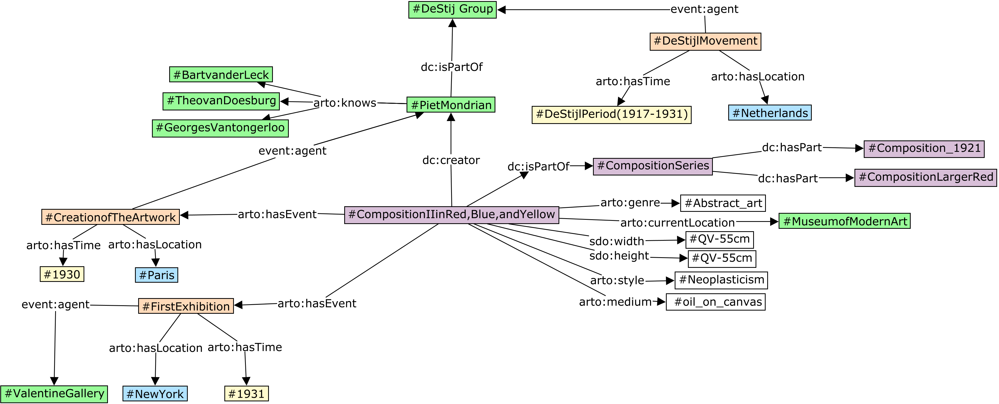
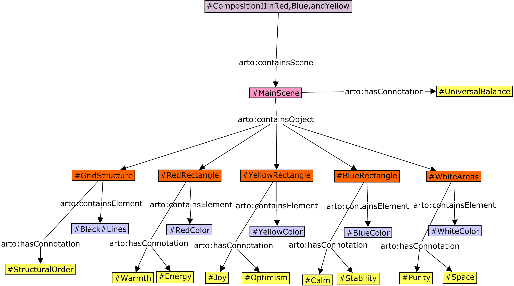
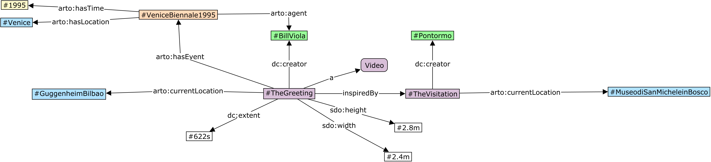
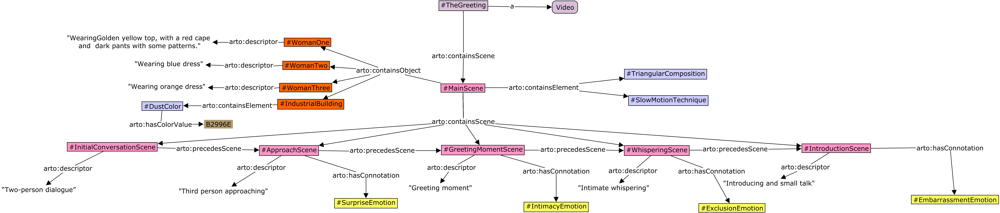
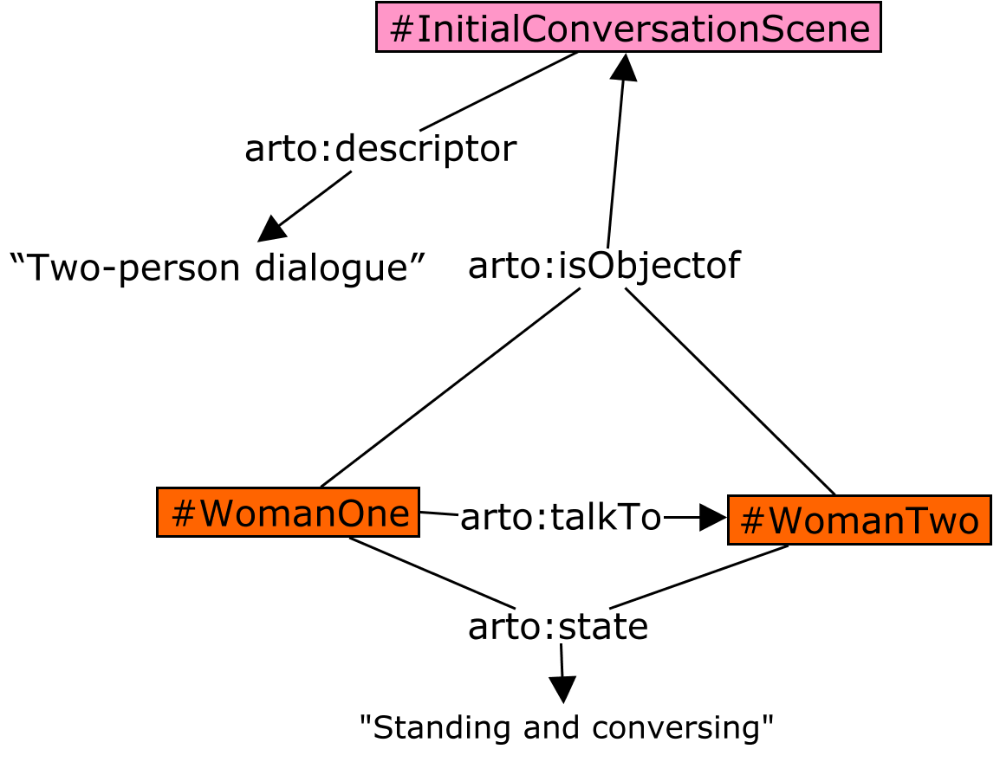
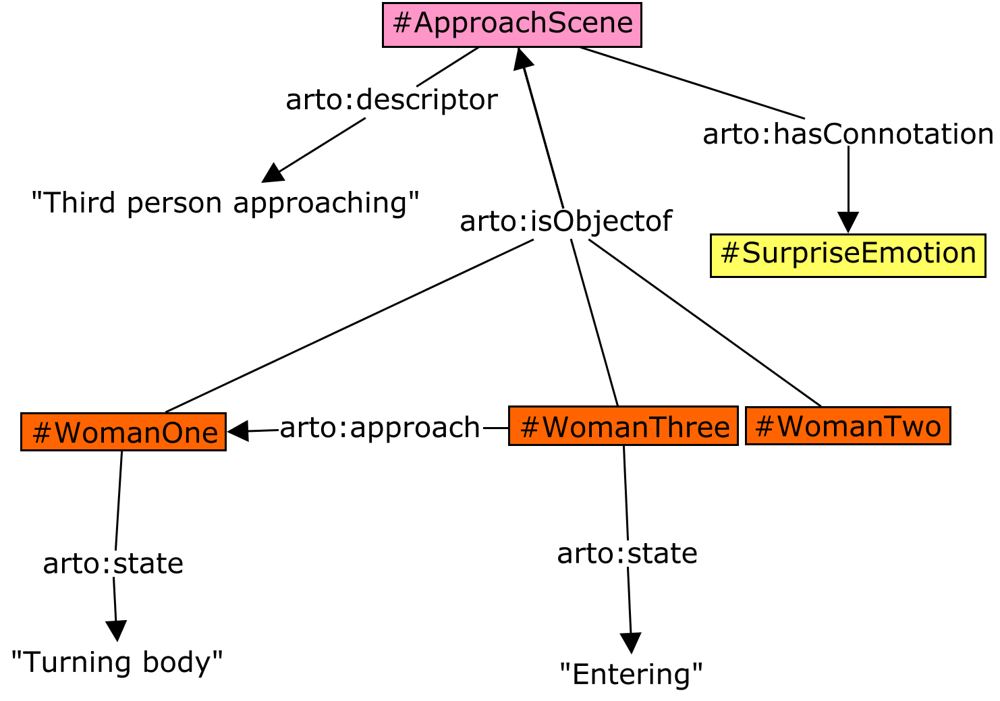
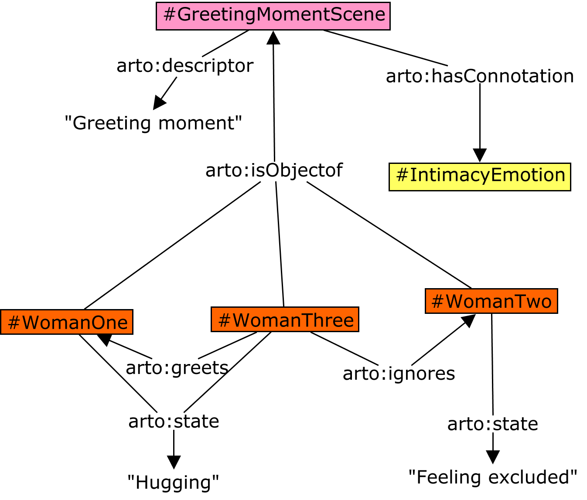
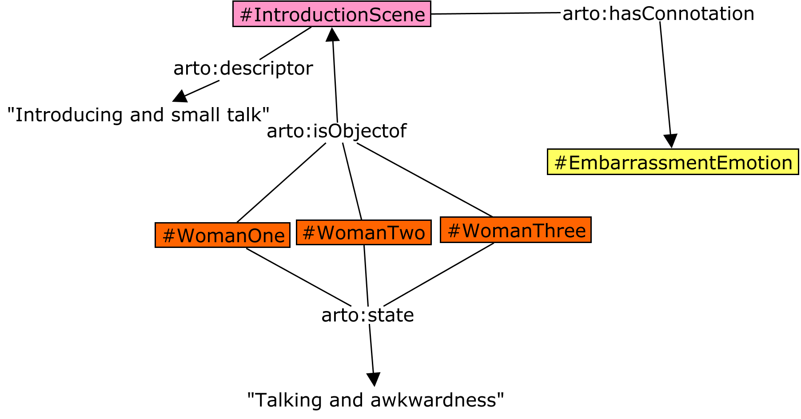
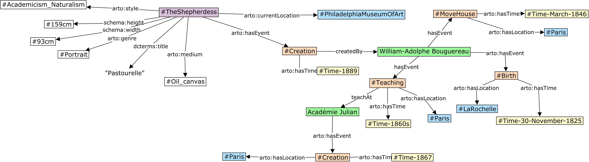

# Artwork Object Ontology Examples

This document demonstrates how various artworks can be represented using the ARTO (ARTwork object Ontology) framework through concrete examples. Each example shows how both descriptive content and contextual information can be captured in a structured manner.


## Comparison Across Art Forms

These examples demonstrate how ARTO can be applied to diverse art forms while maintaining a consistent ontological framework:

| Artwork | Medium | Descriptive Focus | Contextual Focus |
|---------|--------|-------------------|------------------|
| Composition II | Abstract Painting | Geometric elements, color relationships | De Stijl movement, modernism |
| The Thinker | Sculpture | Posture, physicality, bronze material | Gates of Hell commission |
| The Greeting | Video Art | Temporal sequence, emotional progression | Renaissance influence, technical specs |
| The Shepherdess | Painting | Rural figure, pastoral symbolism | 19th century French context |


Despite these artworks differing in medium and form, ARTO offers a unified representation method for all. Whether dealing with two-dimensional paintings, three-dimensional sculptures, or time-based video art, ARTO captures both their attributes and visual features. This flexibility makes ARTO a truly comprehensive artwork representation framework capable of adapting to the diversity and complexity of the art domain.

For the complete RDF representations of these examples, see the [examples](../examples/) directory.


## Composition II with Red, Blue and Yellow (Piet Mondrian, 1930)


"Composition II with Red, Blue and Yellow" is an iconic abstract painting by Dutch artist Piet Mondrian, characterized by its geometric composition of primary colors and black grid lines on a white background. This work exemplifies Mondrian's neoplasticism style.

### Contextual Model Representation



### Descriptive Model Representation




## The Thinker (Auguste Rodin, 1880-1881)


"The Thinker" is one of Auguste Rodin's most famous bronze sculptures, depicting a nude male figure in deep contemplation. Originally titled "The Poet," it was conceived as part of Rodin's larger work "The Gates of Hell," inspired by Dante's Divine Comedy.

### Contextual Model Representation


### Descriptive Model Representation


## The Greeting (Bill Viola, 1995)


"The Greeting" is a video art installation by Bill Viola, inspired by Pontormo's 16th century painting "The Visitation." The work shows an encounter between three women in extreme slow motion, stretching a 45-second action to 10 minutes, allowing viewers to observe subtle emotional changes.

### Contextual Model Representation



### Descriptive Model Representation




<div style="text-align: center;">
  
</div>

``` turtle
<< ex:WomanOne arto:isObjectOf ex:InitialConversationScene >> 
    arto:state "Standing and conversing" ;
    arto:talkTo << ex:WomanTwo arto:isObjectOf ex:InitialConversationScene >> .

<< ex:WomanTwo arto:isObjectOf ex:InitialConversationScene >> 
    arto:state "Standing and conversing" ;
    arto:talkTo << ex:WomanOne arto:isObjectOf ex:InitialConversationScene >> .
```


<div style="text-align: center;">
  
</div>

``` turtle
<< ex:WomanOne arto:isObjectOf ex:ApproachScene >> 
    arto:state "Turning body" .

<< ex:WomanThree arto:isObjectOf ex:ApproachScene >> 
    arto:state "Entering" ;
    arto:approach << ex:WomanOne arto:isObjectOf ex:ApproachScene >> .
```

<div style="text-align: center;">
  
</div>

``` turtle
<< ex:WomanOne arto:isObjectOf ex:GreetingMomentScene >> 
    arto:state "Hugging" .

<< ex:WomanTwo arto:isObjectOf ex:GreetingMomentScene >> 
    arto:state "Feeling excluded" .

<< ex:WomanThree arto:isObjectOf ex:GreetingMomentScene >> 
    arto:state "Hugging" ;
    arto:greets << ex:WomanOne arto:isObjectOf ex:GreetingMomentScene >> ;
    arto:ignores << ex:WomanTwo arto:isObjectOf ex:GreetingMomentScene >> .
```

<div style="text-align: center;">
  
</div>

``` turtle
<< ex:WomanTwo arto:isObjectOf ex:WhisperingScene >> 
    arto:state "Feeling excluded" .

<< ex:WomanThree arto:isObjectOf ex:WhisperingScene >> 
    arto:whisper << ex:WomanOne arto:isObjectOf ex:WhisperingScene >> .
```

<div style="text-align: center;">
  
</div>

``` turtle
<< ex:WomanOne arto:isObjectOf ex:IntroductionScene >> 
    arto:state "Talking and awkwardness" .

<< ex:WomanTwo arto:isObjectOf ex:IntroductionScene >> 
    arto:state "Talking and awkwardness" .

<< ex:WomanThree arto:isObjectOf ex:IntroductionScene >> 
    arto:state "Talking and awkwardness" .
```

## The Shepherdess


"The Shepherdess", also known as "The Little Shepherdess", is a painting by William-Adolphe Bouguereau completed in 1889. The title is taken from the Southern French dialect. The painting depicts an idyllic, pastoral scene of a lone young woman in peasant attire posed for the artist, balancing a stick (likely her crook) across her shoulders, standing barefooted in the foreground. In the background are oxen grazing in a field.


### Contextual Model of The Shepherdess using RDF-star


### Contextual Model of The Shepherdess using RDF


### Descriptive Model of The Shepherdess


